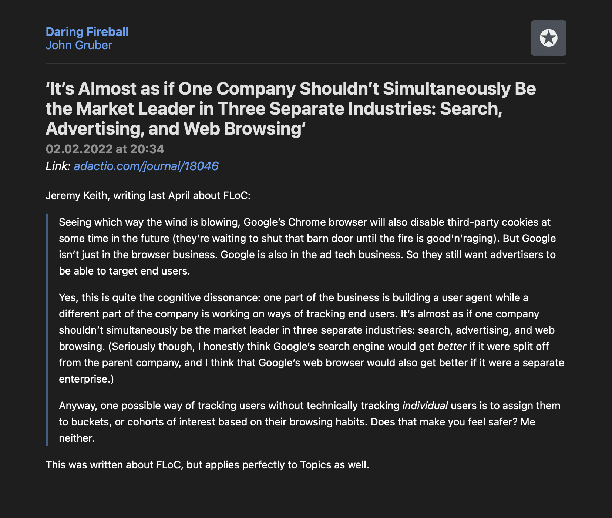

# Unofficial Official NetNewsWire Themes Directory

This is a theme directory for the [NetNewsWire](https://netnewswire.com) RSS reader.
NetNewsWire 6.1 or newer required for themes.

To install a theme you have to download the zip, unpack it and import it to NetNewsWire by either double-clicking it on macOS, sharing it to NetNewsWire on iOS or using the `+` button on iOS.
NetNewsWire has an URL scheme for this but GitHub [strips non-http URL schemes](https://github.community/t/deeplink-urls-are-stripped-from-github-markdown/199464).
The install URL is included as text, you can copy it and open it your browser.

## Preinstalled Themes

### Default

Ranchero Software, 2022-02

This theme is not actually shipped with NetNewsWire as a theme and has instead been reconstructed from the HTML and CSS in the app bundle.
This is the theme that is preset in NetNewsWire.

`netnewswire://theme/add?url=https://github.com/Kamik423/NetNewsWire-Themes/raw/main/default-themes/Default_/Default_.nnwtheme.zip`

### Appanoose

Ranchero Software, 2022-02

`netnewswire://theme/add?url=https://github.com/Kamik423/NetNewsWire-Themes/raw/main/default-themes/Appanoose/Appanoose.nnwtheme.zip`

### [NewsFax](https://github.com/stuartbreckenridge/NewsFax)

[Stuart Breckenridge](https://github.com/stuartbreckenridge), 2022-02

A modified version of the Promenade theme, inspired by Teletext and Ceefax services of yesteryear.
It comes complete with Teletext style page numbers and R/G/B/Y options along the bottom of each article.

Remote control not included.

`netnewswire://theme/add?url=https://github.com/Kamik423/NetNewsWire-Themes/raw/main/default-themes/NewsFax/NewsFax.nnwtheme.zip`

The NewsFax themes uses the ModeSeven font throughout, which is available as Freeware.
For more information read the license information inside bundle.

### [Promenade](https://github.com/stuartbreckenridge/NNWThemesPromenade)

[Stuart Breckenridge](https://github.com/stuartbreckenridge), 2021-09

Prominent titles, snazzy blockquotes, and simplified external links.
Charter and Avenir for your viewing pleasure.

`netnewswire://theme/add?url=https://github.com/Kamik423/NetNewsWire-Themes/raw/main/default-themes/Promenade/Promenade.nnwtheme.zip`

### Sepia

Ranchero Software, 2022-02

This theme does not differentiate between light and dark modes.

`netnewswire://theme/add?url=https://github.com/Kamik423/NetNewsWire-Themes/raw/main/default-themes/Sepia/Sepia.nnwtheme.zip`

## User Created Themes

### [Broadsheet](https://github.com/stuartbreckenridge/NNWThemesBroadsheet)

[Stuart Breckenridge](https://github.com/stuartbreckenridge), 2021-09

If NetNewsWire were a newspaper—and it if were, it’d be a quality read—it might look like this.
The New York typeface is used throughout and the favicon has been removed.

`netnewswire://theme/add?url=https://github.com/Kamik423/NetNewsWire-Themes/raw/main/user-themes/Broadsheet/Broadsheet.nnwtheme.zip`

### Druckpresse

[Hans Schülein](https://github.com/kamik423), 2022-02

Modification of Appanoose with the New York system font inspired by classic print newspapers.

`netnewswire://theme/add?url=https://github.com/Kamik423/NetNewsWire-Themes/raw/main/user-themes/Druckpresse/Druckpresse.nnwtheme.zip`

## Creating Your Own Theme

Refer to [the technote](https://github.com/Ranchero-Software/NetNewsWire/blob/main/Technotes/Themes.md) and the insanely well documented [Promenade](https://github.com/stuartbreckenridge/NNWThemesPromenade) theme.

## Contributing Your Own Theme

Create a pull request with your theme.
Include the `.nnwtheme`-bundle as a zip and take screenshots of the same size in both light and dark mode (if applicable) in the same directory.
Include the theme in the *User Created Themes* folder of the README (keep the order alphabetical).
Match the format of the other themes; including

* An author and a date
* Optionally: A description of the theme
* One or two images of the same size set to 50% width. Pick a random RSS article; it should optimally include a blockquote to show off that feature.
* The NetNewsWire URL scheme.

## License

You can include your own license in the `.nnwtheme`-bundle.
Please then also note the license in the readme.
If you do not include a license the theme is presumed to be license under the [MIT license](LICENSE.md), as are the rest of the documents included in this repository.